# RL-Nautilus Phase-2 — Architecture

**Scope:** Nautilus core + RL layer only. The `cve2grammar/` subtree is the
grammar-authoring pipeline and is intentionally **out of scope** here; see
`cve2grammar/README.md` for that layer.

**Source of truth:** code at commit `77801e6` (branch `phase-2`,
indexed by GitNexus 2026-04-21 — 92 files, 1358 symbols, 3429 edges,
115 execution flows).

**Diagram legend**

- Mermaid renders in GitHub, VS Code (Markdown Preview Mermaid Support), Obsidian, and most mkdocs themes.
- Colour coding used throughout:
  - 🟦 blue = Rust core (nautilus / grammartec / forksrv)
  - 🟣 violet = RL layer (rl_hook / dqn / rl_logger)
  - 🟨 yellow = Python grammars / shared lock objects
  - 🟥 red = C harness / SQLite
- Section numbering: diagrams are placed where the reader hits the concept first; ASCII blocks are kept only when they carry extra detail not in the diagram.

---

## 0. One-page component view

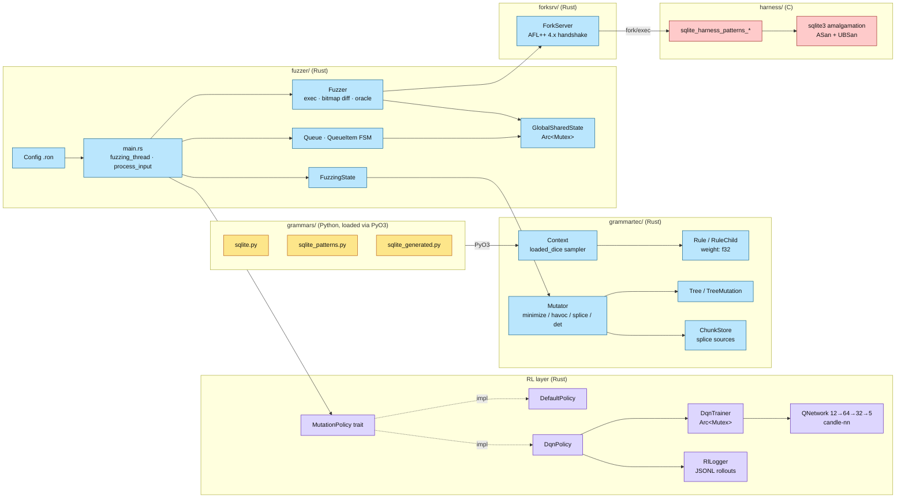

---

## 1. Module map

```
rl-nautilus-phase-2/
├── fuzzer/src/           Rust — coordinator, RL, I/O, state machine
│   ├── main.rs           637  entrypoint, fuzzing_thread, process_input
│   ├── state.rs          203  FuzzingState: minimize/havoc/splice/det/gen
│   ├── fuzzer.rs         450  Fuzzer: exec harness, bitmap diff, oracle
│   ├── queue.rs          195  Queue + QueueItem + InputState FSM
│   ├── shared_state.rs    71  GlobalSharedState (per-thread-shared counters)
│   ├── config.rs          88  Config (.ron) + RL hyperparams w/ serde defaults
│   ├── rl_hook.rs        121  MutationPolicy trait, DefaultPolicy, DqnPolicy
│   ├── dqn.rs            421  DqnTrainer, DqnWorker, QNetwork, replay buffer
│   ├── dqn_test.rs        82  unit tests for DQN
│   ├── rl_logger.rs      141  JSONL rollout logger (per-thread)
│   ├── python_grammar_loader.rs 70  PyO3 bridge — loads grammars/*.py
│   ├── generator.rs      115  CLI: generate N grammar-derived inputs
│   └── mutation_tester.rs 116  CLI: single-mutation exerciser
│
├── grammartec/src/       Rust — grammar engine
│   ├── context.rs        479  Context: nonterminals, weighted sampling
│   ├── rule.rs           388  Rule / RuleChild / weights (Rule::weighted)
│   ├── tree.rs           566  Tree, TreeMutation, Unparser
│   ├── mutator.rs        571  minimize_tree/mut_random/mut_splice/mut_rules
│   ├── chunkstore.rs     141  ChunkStore for splice source material
│   ├── recursion_info.rs 109  recursion discovery for havoc_recursion
│   └── newtypes.rs       164  NTermID, RuleID, NodeID
│
├── forksrv/src/          Rust — AFL++ fork-server client
│   ├── lib.rs            294  ForkServer: handshake, SHM, run(), timeout
│   ├── exitreason.rs      23  ExitReason (Normal/Timeout/Signaled/Asan/Ubsan)
│   ├── error.rs           69  SubprocessError
│   └── newtypes.rs        40  strongly-typed file descriptors / SHM ids
│
├── harness/              C — AFL-compatible SQLite harnesses
│   ├── sqlite_harness.c              phase-1 base harness
│   ├── sqlite_harness_patterns.c     phase-2 base (Gen-Storage aware)
│   ├── sqlite_harness_cve13434.c     CVE-2020-13434 targeted harness
│   └── sqlite_harness_patterns_sqlite-{3.30.1,3.31.1,3.32.0,3.32.2}  binaries
│
└── grammars/             Python — grammars loaded at runtime via PyO3
    ├── sqlite.py                   phase-1 hand-authored weighted grammar
    ├── sqlite_patterns.py          phase-2 base (with Gen-Storage)
    ├── sqlite_patterns_uniform.py  uniform-weight baseline
    ├── sqlite_generated.py         rendered from cve2grammar cache
    └── sqlite_cve13434.py          CVE-targeted grammar
```

Three Cargo crates, one workspace: `fuzzer` depends on `grammartec` and `forksrv`.

---

## 2. End-to-end dataflow

### 2.1 Startup + worker lifecycle (sequence)

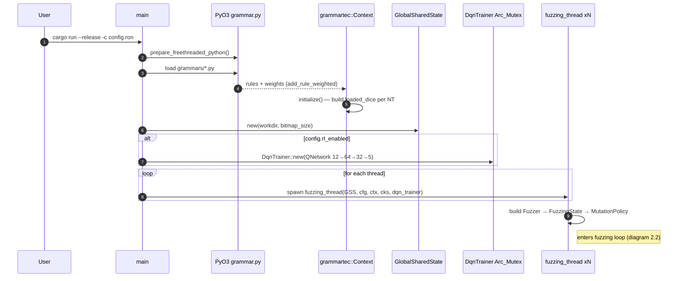

### 2.2 Per-input processing loop (flow)

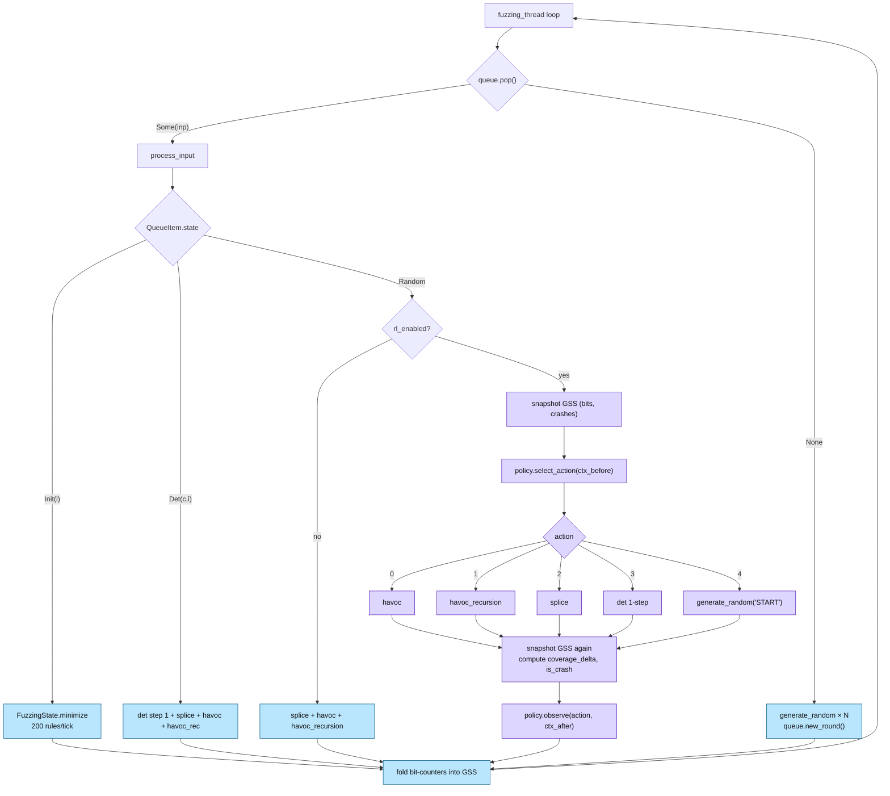

### 2.3 Reference: text form

```
┌───────────────────────────────────────────────────────────────────────────┐
│                                 main()                                    │
│  1. pyo3::prepare_freethreaded_python()                                   │
│  2. Parse config.ron  →  Config                                           │
│  3. python_grammar_loader::load(grammars/*.py)  →  grammartec::Context    │
│     • calls Python get_context() over PyO3                                │
│     • Context builds NTerm/Rule tables + loaded_dice weighted sampler     │
│  4. ChunkStoreWrapper::new() (splice source pool, locked)                 │
│  5. GlobalSharedState::new() (queue + crash/normal bitmaps)               │
│  6. Optional: DqnTrainer::new()  (if rl_enabled)                          │
│  7. Spawn N = config.number_of_threads × fuzzing_thread(...)              │
└───────────────────────────────────────────────────────────────────────────┘
                                    │
                                    ▼
┌───────────────────────────────────────────────────────────────────────────┐
│                        fuzzing_thread  (per-worker loop)                  │
│   build Fuzzer  →  FuzzingState  →  MutationPolicy (Default | Dqn)        │
│   loop {                                                                  │
│     inp = global_state.queue.pop()                                        │
│     if inp: process_input(state, inp, cfg, policy, global)                │
│        on SubprocessError → rebuild Fuzzer (restarts fork server)         │
│     else  : for _ in 0..number_of_generate_inputs:                        │
│                 state.generate_random("START")                            │
│              global.queue.new_round()                                     │
│     fold per-strategy bit counters into GlobalSharedState                 │
│   }                                                                       │
└───────────────────────────────────────────────────────────────────────────┘
                                    │
                                    ▼
┌───────────────────────────────────────────────────────────────────────────┐
│                             process_input  (FSM)                          │
│                                                                           │
│   QueueItem.state ∈ { Init(i) | Det(cycle,i) | Random }                   │
│                                                                           │
│   Init(i)     → FuzzingState.minimize(inp, i, i+200)                      │
│                 └ Mutator.minimize_tree + minimize_rec                    │
│                 └ fuzzer.has_bits(...) checks bitmap                      │
│                 complete? → rl_enabled ? Random : Det                     │
│                                                                           │
│   Det(c,i)    → FuzzingState.deterministic_tree_mutation(inp, i, i+1)     │
│                 + splice + havoc + havoc_recursion                        │
│                                                                           │
│   Random      → (rl_enabled?) policy.select_action(ctx_before)            │
│                   None → splice + havoc + havoc_recursion (DefaultPolicy) │
│                   Some(a):                                                │
│                     0 havoc, 1 havoc_recursion, 2 splice,                 │
│                     3 det(single step), 4 generate_random("START")        │
│                 then policy.observe(a, ctx_after)                         │
└───────────────────────────────────────────────────────────────────────────┘
                                    │
                                    ▼
┌───────────────────────────────────────────────────────────────────────────┐
│           FuzzingState mutation primitives (→ Mutator → Tree ops)         │
│                                                                           │
│   havoc           100× mut_random    → fuzzer.run_on_with_dedup(Havoc)    │
│   havoc_recursion  20× mut_random_recursion           (HavocRec)          │
│   splice          100× mut_splice (reads ChunkStore)  (Splice)            │
│   det             mutator.mut_rules(start..end)       (Det)               │
│   generate_random ctx.generate_tree_from_nt(nt,len)   (Gen)               │
│   minimize        mutator.minimize_tree + minimize_rec + chunkstore.add   │
└───────────────────────────────────────────────────────────────────────────┘
                                    │
                                    ▼
┌───────────────────────────────────────────────────────────────────────────┐
│                    Fuzzer / ForkServer — execution layer                  │
│                                                                           │
│   run_on_with_dedup(tree, reason, ctx):                                   │
│     1. Unparser serialises tree → SQL bytes                               │
│     2. Writes bytes to input file (@@-arg path)                           │
│     3. ForkServer.run():                                                  │
│        • writes 4-byte command to status pipe                             │
│        • reads child PID + exit status from fork server                   │
│        • on handshake: detect 0x41464c?? hello, reply XOR 0xffffffff,     │
│          read capabilities, honour AFL_MAP_SIZE                           │
│     4. Child executes harness; writes AFL bitmap to shared memory         │
│     5. Fuzzer diffs bitmap vs global → counts fresh bits by strategy      │
│     6. Classify ExitReason:                                               │
│          exit 0       → Normal       (semantic errors ignored)            │
│          exit 1       → Ubsan        (UBSAN_OPTIONS=halt_on_error)        │
│          exit 223     → Asan         (ASAN_OPTIONS=abort_on_error)        │
│          WIFSIGNALED  → Signaled     (SIG5/SIGTRAP = SQLite debug assert) │
│          timeout      → Timeout                                           │
│     7. On new coverage or crash → promote to queue, dump artefact         │
└───────────────────────────────────────────────────────────────────────────┘
```

Execution flows resolved by the GitNexus index (same call chain as above):
`proc_52_fuzzing_thread` → `proc_68_process_input` → `grammartec::mutator`.

---

## 3. Grammar engine (Nautilus core)

Source: `grammartec/` — unchanged at the algorithmic level vs upstream
Nautilus 2.0. The phase-1 patch that matters is **per-rule weights**.

### 3.1 Types

| Type | File | Role |
|---|---|---|
| `NTermID`, `RuleID`, `NodeID` | `newtypes.rs` | strongly-typed indices |
| `Rule { nt, children, weight: f32 }` | `rule.rs` | production rule w/ sampling weight |
| `RuleChild { Terminal(Vec<u8>) | NTerm(NTermID) }` | `rule.rs` | RHS element |
| `Context { nterms, rules, loaded_dice_by_nt: HashMap<NTermID,Dice> }` | `context.rs` | grammar compiled form |
| `Tree { rules, sizes, paren }` | `tree.rs` | derivation tree |
| `TreeMutation<'a>` | `tree.rs` | patch over a parent tree |
| `Mutator` | `mutator.rs` | all mutation algorithms |

### 3.2 Grammar compilation (Python → Context)

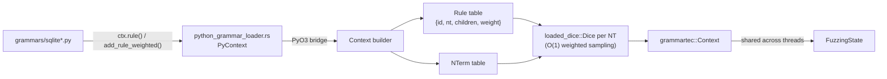

### 3.3 Weighted sampling

- `Rule::weighted(id, name, weight)` creates a rule with a non-unit weight.
- Python grammar writes call `ctx.add_rule_weighted(nterm, rule, weight)`.
- `Context::initialize()` builds a per-nonterminal
  `loaded_dice::Dice` table, giving **O(1) weighted sampling** at generate time.
- Default weight is 1.0 → behaviour matches upstream Nautilus for legacy grammars.

### 3.4 Mutation primitives used by the state machine

| `Mutator` method | `FuzzingState` wrapper | Pass count |
|---|---|---|
| `mut_rules`       | `deterministic_tree_mutation` | 1 per FSM tick |
| `mut_random`      | `havoc`             | 100× |
| `mut_random_recursion` | `havoc_recursion` |  20× |
| `mut_splice`      | `splice`            | 100× (reads `ChunkStore`) |
| `minimize_tree`   | `minimize`          | drives `Init(i)` |
| `minimize_rec`    | `minimize`          | drives `Init(i)` |

### 3.5 PyO3 grammar loader

`fuzzer/src/python_grammar_loader.rs` exposes `PyContext.get_context()` which
runs the Python grammar file once at startup, collects all
`ctx.rule()` / `ctx.add_rule_weighted()` calls, and returns a compiled
`grammartec::Context`. Nautilus loads **exactly one** grammar per run.

---

## 4. Fuzzing loop state machine

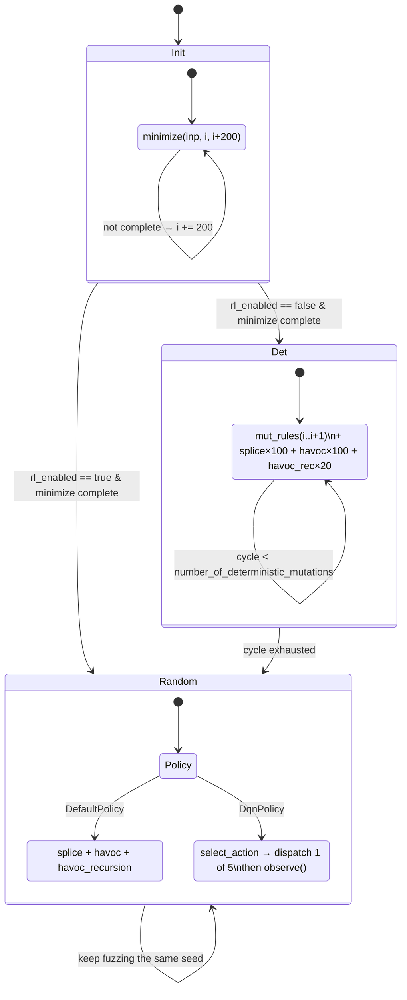

`queue::InputState` drives the per-input FSM inside `process_input`:

```
             ┌───────────── minimize 200 rules at a time ─────────────┐
             │                                                        │
             ▼                                                        │
  ┌──► Init(start_index) ──complete?──► Det((0,0))        (rl_enabled=false)
  │                                 └─► Random            (rl_enabled=true)
  │                                                            │
  │                                                            │
  │    Det((cycle,start_index))                                │
  │       ├─ mut_rules(start..start+1)                         │
  │       ├─ splice × 100                                      │
  │       ├─ havoc × 100                                       │
  │       ├─ havoc_recursion × 20                              │
  │       └─ cycle++ until number_of_deterministic_mutations ──┘
  │
  │    Random                       (Default policy)
  │       ├─ splice + havoc + havoc_recursion
  │
  └──  Random                       (DQN policy, rl_enabled=true)
          ├─ snapshot GlobalSharedState counters (bits & crashes)
          ├─ action = policy.select_action(ctx_before)
          ├─ dispatch exactly one primitive by action ∈ {0..=4}
          ├─ snapshot GlobalSharedState counters again
          └─ policy.observe(action, ctx_after)
```

Key invariant: when `rl_enabled=true`, the `Init → Det` transition is skipped
— the RL agent owns strategy selection and can still choose Det via action 3.

---

## 5. Fork server / harness (execution layer)

### 5.0 Handshake + per-execution protocol

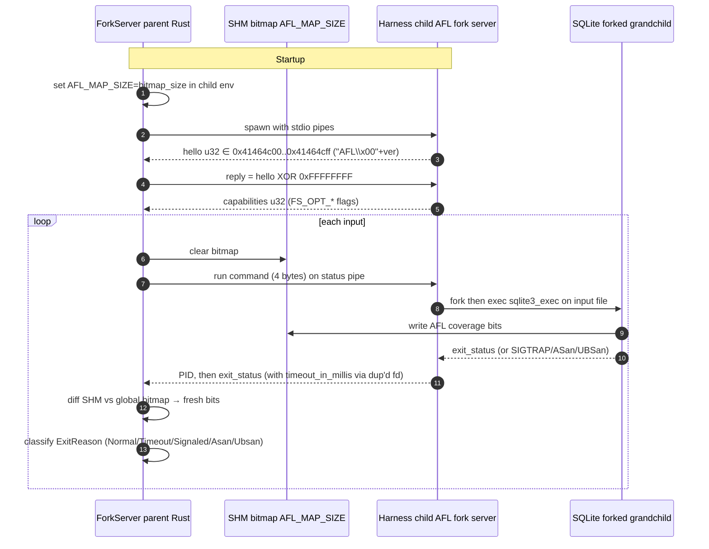

### 5.1 `forksrv/src/lib.rs` — `ForkServer`

- Attaches to the AFL-instrumented target process via stdio pipes +
  POSIX shared memory for the coverage bitmap.
- **Handshake** (AFL++ 4.x protocol, confirmed and fixed):
  1. Child → parent: hello `u32` in `0x41464c00..=0x41464cff` (ASCII `"AFL\x00"`+version).
  2. Parent → child: reply with `hello XOR 0xffffffff`.
  3. Child → parent: capability `u32` (FS_OPT_* flags).
  4. Child env already has `AFL_MAP_SIZE=<bitmap_size>` so the runtime allocates the right SHM.
- **Runtime** (`run()`): for each execution, parent writes a command, reads the
  child PID, waits for exit status with a `dup()`-ed fd and `timeout_in_millis`.

### 5.2 C harnesses

Three variants under `harness/`. All share the same contract:

- `__AFL_INIT()` only — **no `__AFL_LOOP`** (persistent mode is incompatible
  with Nautilus's request/response fork-server protocol).
- `argv[1]` = input path (the `@@` token); `forksrv` prepends `argv[0]`.
- Pre-loads a SQLite schema in `:memory:`; one `sqlite3_exec()` per fork.
- Oracle via exit codes:
  - `ASAN_OPTIONS=abort_on_error=1:exitcode=223` → exit 223 = ASan crash.
  - `UBSAN_OPTIONS=halt_on_error=1` → exit 1 = UBSan crash.
  - `SIG5/SIGTRAP` = `SQLITE_DEBUG` assertion.

Binaries built for all four target versions:
`sqlite_harness_patterns_sqlite-{3.30.1, 3.31.1, 3.32.0, 3.32.2}`.

---

## 6. RL layer

**RL is partially implemented** — this is the most common thing readers get
wrong. The older `rl_hook.rs` stub has been replaced; phase-2 ships a working
DQN agent behind `config.rl_enabled`.

### 6.0.a Component view — how workers share the trainer

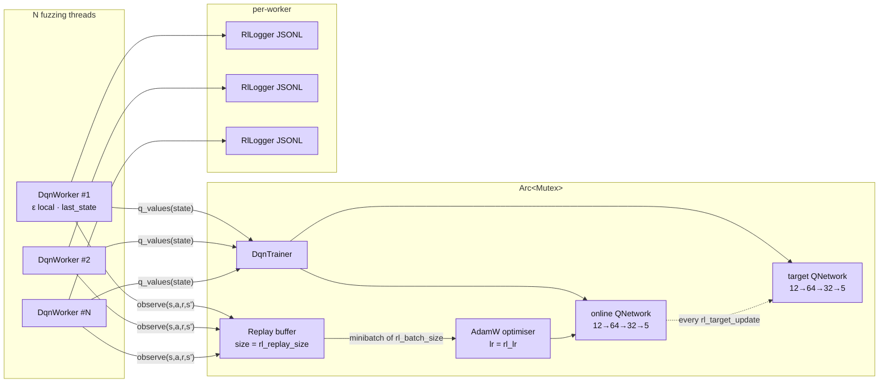

### 6.0.b Action / observation / reward loop (per input)

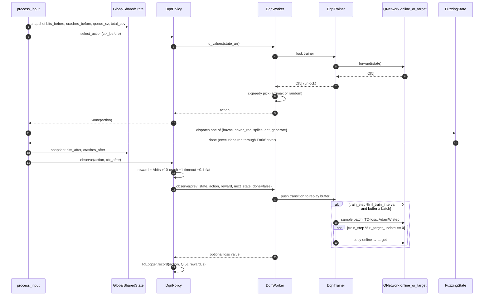

### 6.1 Trait surface — `fuzzer/src/rl_hook.rs`

```rust
pub struct PolicyContext {
    pub coverage_delta: usize,     // fresh bits this tick
    pub is_crash: bool,
    pub is_timeout: bool,
    pub total_coverage: usize,     // popcount(bitmap)
    pub exec_count: u64,
    pub queue_size: usize,
    pub strategy_emas: [f32; 5],   // per-strategy reward EMAs (stubbed to 0)
    pub last_action: Option<u8>,
}

pub trait MutationPolicy: Send {
    fn select_action(&mut self, _ctx: &PolicyContext) -> Option<u8> { None }
    fn observe    (&mut self, _action: u8, _ctx: &PolicyContext)    {}
}

pub struct DefaultPolicy;                 // no-op → falls back to stock Nautilus
pub struct DqnPolicy { worker, logger }   // DQN agent via DqnWorker
```

### 6.2 Action space (5 discrete actions)

| Action | Strategy | `FuzzingState` call |
|---|---|---|
| 0 | Havoc          | `havoc(inp)` |
| 1 | HavocRec       | `havoc_recursion(inp)` |
| 2 | Splice         | `splice(inp)` |
| 3 | Det (1 step)   | `deterministic_tree_mutation(inp, 0, 1)` |
| 4 | Generate       | `generate_random("START")` |

Unknown action → fallback to `splice + havoc + havoc_recursion`.

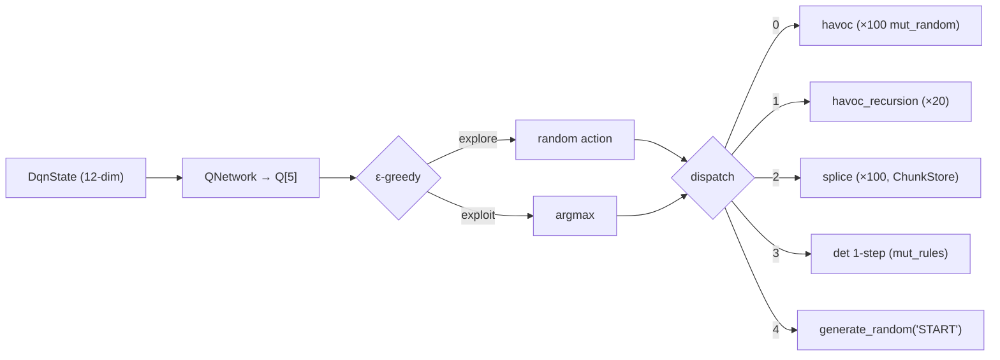

### 6.3 State representation — `DqnState` (12-dim)

```
[coverage_delta/100, total_coverage/262144, coverage_velocity,
 is_crash, crash_rate, queue_size/10000, log10(exec_count)/7,
 havoc_ema, havocrec_ema, splice_ema, det_ema, generate_ema]
```

Normalisations bake reasonable scales into the input layer. `coverage_velocity`
and `crash_rate` are wired as stubs (P2-13 TODO in comments).

### 6.4 Reward

```
reward = coverage_delta
       + 10.0  if is_crash
       - 1.0   if is_timeout
       - 0.1   if coverage_delta == 0 && !is_crash
```

Coverage-dominant reward with a big bonus for crashes and a small tax on
flat, non-crashing executions.

### 6.5 Network — `fuzzer/src/dqn.rs`

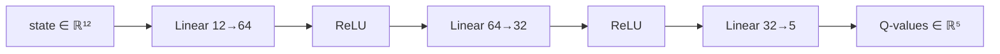


- MLP **12 → 64 → 32 → 5** with ReLU between layers.
- Backend: `candle-core` + `candle-nn` (pure-Rust).
- Optimiser: `AdamW` (lr configurable).
- Double-DQN pattern: online + target network, target copied every
  `rl_target_update` training steps.
- Epsilon-greedy exploration: linear decay
  `ε_start → ε_end` over `rl_epsilon_decay` steps.
- Replay buffer sized by `rl_replay_size`, batched by `rl_batch_size`,
  training every `rl_train_interval` executions.

### 6.6 Threading

`DqnTrainer` is held behind `Arc<Mutex<…>>` and shared across threads.
Each worker gets its own `DqnWorker` (snapshot of epsilon, local scratch)
that locks the trainer only to query Q-values and push experience tuples.
Per-worker `RlLogger` writes JSONL rollouts into the workdir.

### 6.7 Config surface — `config.rs`

All RL knobs are optional (serde defaults), so existing `.ron` files keep
working. Defaults:

```
rl_enabled          = false
rl_epsilon_start    = 1.0
rl_epsilon_end      = 0.05
rl_epsilon_decay    = 50 000  steps
rl_batch_size       = 32
rl_replay_size      = 3 000
rl_gamma            = 0.99
rl_lr               = 0.001
rl_target_update    = 1 000   train steps
rl_train_interval   = 100     exec steps
```

### 6.8 Known RL gaps

- `coverage_velocity` and `crash_rate` in `DqnState` are constant `0.0`
  (rolling windows not yet computed).
- `strategy_emas` passed to `PolicyContext` is a stubbed `[0.0; 5]`.
  The logger records per-action reward but the EMA ring isn't fed back
  into the next state — losing useful signal.
- The Det stage (`InputState::Det`) is still controlled by the deterministic
  FSM, not by the policy. Only `InputState::Random` is RL-driven.

These are documented as Phase-2 TODOs (`P2-6`, `P2-13` comments in source).

---

## 7. Synchronisation and shared state

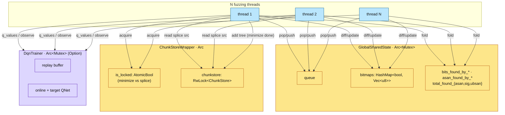

```
GlobalSharedState  (Arc<Mutex<…>>, shared by all fuzzing threads)
├── queue:                       Queue of QueueItem (Init/Det/Random FSM per item)
├── bitmaps: HashMap<bool,Vec>   two AFL coverage bitmaps (normal + crash)
├── execution_count              cumulative
├── average_executions_per_sec
├── bits_found_by_<strategy>     per-strategy coverage gain counters
├── asan_found_by_<strategy>     per-strategy ASan crash counters
├── total_found_{asan,sig,ubsan} lifetime crash totals
└── last_found_{asan,sig}, last_timeout, state_saved

ChunkStoreWrapper  (Arc<…, is_locked: AtomicBool>)
└── chunkstore: RwLock<ChunkStore>     splice source material

DqnTrainer  (Option<Arc<Mutex<…>>>)
└── replay buffer, online net, target net, step counter
```

Three lock-families, three disjoint hot paths: coverage counters, splice
sources, and RL training. Contention is kept low because RL training runs
every 100 executions, splice is a read-mostly RwLock, and bit-counter folds
happen at the end of each input.

---

## 8. Runtime entrypoints

| Binary | Source | Purpose |
|---|---|---|
| `fuzzer`          | `fuzzer/src/main.rs`           | full campaign |
| `generator`       | `fuzzer/src/generator.rs`      | emit N grammar-derived inputs (no exec) |
| `mutation_tester` | `fuzzer/src/mutation_tester.rs`| single-mutation debug harness |

Build: `PYO3_USE_ABI3_FORWARD_COMPATIBILITY=1 cargo build --release`
(required for Python 3.13 under `pyo3 0.21`).

Make targets: `setup` / `grammar` / `fuzz-smoke` / `fuzz-compare` / `test`.

---

## 9. Current results (most recent measured)

| Metric | Value | Source |
|---|---|---|
| Pilot campaign (sqlite-3.31.1, 5 min) | 18 984 exec (~299 exec/s with ASan+UBSan) | CLAUDE.md §Phase-1 |
| Crashes in pilot                      | 219 SIG crashes — all CVE-2020-13434 printf-overflow variants | CLAUDE.md §Phase-1 |
| Queue growth                          | 1002 items, 7 timeouts | CLAUDE.md §Phase-1 |
| Distinct crash SQL patterns           | 15 (`%.*g`, `%.*f`, `%.*e`, `%-10s` with INT32_MAX arg) | CLAUDE.md §Phase-1 |
| Harness throughput (smoke, no ASan)   | 1422 exec/30 s (~47 exec/s) | CLAUDE.md §argv-bug |
| AFL handshake bare-metal              | 756 exec/s | CLAUDE.md §Phase-1 |
| Oracle — CVE-2020-13434               | `SELECT printf('%.*g',2147483647,0.01)` → UBSan exit 1 on 3.31.1 | CLAUDE.md §Phase-1 |

**Not yet measured:** 24 h campaigns on any version, DQN-vs-Default A/B,
weighted-vs-uniform grammar A/B, TTFC / coverage-growth / bits-per-strategy
analysis.

---

## 10. Open gaps (ordered by what unblocks the next experiment)

1. **`sqlite_generated.py` not self-contained.** It imports 24 base
   non-terminals from `sqlite_patterns.py` but Nautilus loads exactly one
   grammar — fix is to make `scripts/build_grammar.sh` prepend the base
   grammar before the rendered body. Blocks `make fuzz-smoke` /
   `make fuzz-compare`. Spec / plan live under
   `cve2grammar/docs/superpowers/`.
2. **`dev` branch reconciliation.** Uniform grammar + `weight_dump` fix +
   all-4-CVE-harness builds are on `dev`, not yet on `phase-2`.
3. **RL state signals.** Fill `coverage_velocity`, `crash_rate`, and the
   per-strategy `strategy_emas[5]` ring; otherwise the DQN observes a
   12-vector that is effectively 9-dim.
4. **A/B evaluation plumbing.** Need a shared analyser that reads the
   per-thread JSONL rollout logs and emits TTFC / coverage-growth /
   bits-per-strategy tables.
5. **24 h campaigns** across all four CVE versions (3.30.1, 3.31.1, 3.32.0,
   3.32.2) — both with `rl_enabled=false` and `rl_enabled=true`.
