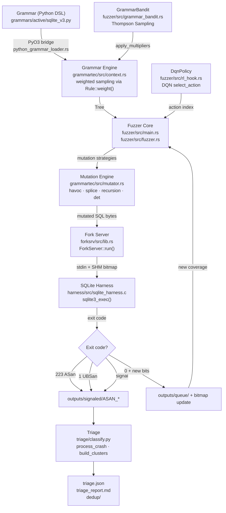
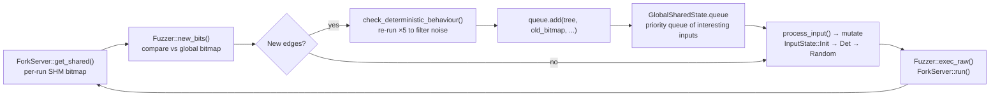

# Architecture — rl-nautilus-phase-2

> Last updated: 2026-05-06. This document is derived from reading the actual
> source code; all function names and struct names refer to code in the
> repository at the time of writing.

---

## 1. System Overview

rl-nautilus-phase-2 is a grammar-based fuzzer built on the Nautilus 2.0
architecture, extended with Reinforcement Learning for adaptive mutation
strategy selection and Thompson Sampling for grammar weight adaptation.
The system targets SQLite, fuzzing four CVE-bearing versions
(3.30.1, 3.31.1, 3.32.0, 3.32.2) to measure how weighted grammar sampling
and RL-guided mutation strategies affect CVE rediscovery rates relative to
uniform baselines.

The pipeline has five layers: grammar definitions drive a weighted generation
engine; the fuzzer core orchestrates multi-threaded mutation, execution, and
coverage tracking; a fork-server mediates communication with the instrumented
SQLite harness; crashes land in an output directory; a triage pipeline
deduplicates and classifies them.



---

## 2. Component Map

| Component | Language | LoC (approx.) | Key Files | Purpose |
|-----------|----------|--------------|-----------|---------|
| **fuzzer/** | Rust | ~3,254 | `src/main.rs`, `src/fuzzer.rs`, `src/grammar_bandit.rs`, `src/rl_hook.rs`, `src/dqn.rs` | Multi-threaded coordinator, state machine, mutation dispatch, RL policy interface, DQN agent |
| **grammartec/** | Rust | ~2,466 | `src/context.rs`, `src/rule.rs`, `src/mutator.rs`, `src/tree.rs` | Grammar engine, weighted sampling, tree representation, mutation primitives |
| **forksrv/** | Rust | ~426 | `src/lib.rs` | AFL fork-server protocol, shared memory bitmap, process lifecycle |
| **harness/** | C | ~89 | `src/sqlite_harness.c` | AFL fork-server harness, `setup_db()` constructor, `__AFL_INIT()`, crash oracle |
| **triage/** | Python | ~878 | `classify.py`, `stack_dedup.py`, `cve_signatures.py`, `fidelity_score.py`, `minimize.py` | Crash deduplication, exit-code classification, stack-hash grouping, CVE signature matching |
| **cve2grammar/** | Python | separate subtree | `cve2grammar/emitter.py`, `generalizer/render.py`, `generalizer/validate.py`, `generalizer/nonterminals.py` | CVE-to-grammar pipeline: scrape bugs, generalize to templates, validate, emit `ctx.rule()` calls |
| **scripts/** | Bash + Python | ~1,990 | `run_eval.sh`, `run_ablation.sh`, `capture_coverage.py`, `build_grammar.sh`, `analyze.py` | Campaign automation, ablation matrix, coverage CSV analysis, grammar composition |
| **grammars/** | Python DSL | varies | `active/sqlite_v3.py`, `legacy/sqlite_patterns.py`, `legacy/sqlite_attack.py` | Grammar definitions consumed by `python_grammar_loader::load_python_grammar()` |

---

## 3. Data Flow

This section traces a single fuzzing iteration from rule selection through
crash classification, referencing actual function names.

### Step 1 — Grammar loading

At startup, `main()` in `fuzzer/src/main.rs` calls
`python_grammar_loader::load_python_grammar(&grammar_path)`. This acquires the
Python GIL, executes the grammar `.py` file inside a local namespace containing
a `PyContext` object, and returns a `Context` (from `grammartec/src/context.rs`).

The `PyContext` exposes three methods to the Python grammar:

- `ctx.rule(nt, format, weight=1.0)` — calls `Context::add_rule_weighted()`
- `ctx.script(nt, nts, script, weight=1.0)` — calls `Context::add_script_weighted()`
- `ctx.regex(nt, regex, weight=1.0)` — calls `Context::add_regex_weighted()`

Each call appends a `Rule` variant (`Rule::Plain`, `Rule::Script`, or
`Rule::RegExp`) to `Context.rules` and registers it in `Context.nts_to_rules`.

### Step 2 — Thread initialization

`main()` clones the `Context` for each fuzzing thread and spawns
`N` threads (`config.number_of_threads`) calling `fuzzing_thread()`. A
`GlobalSharedState` and `ChunkStoreWrapper` are shared across all threads via
`Arc<Mutex<>>`. If `config.rl_enabled` is `true`, a shared `DqnTrainer` is
created (backed by `candle-nn`). If `config.policy == "bandit"`, a shared
`GrammarBandit` is created.

### Step 3 — Input generation

When the queue is empty, each thread calls `state.generate_random("START")`,
which calls `Context::generate_tree_from_nt()` starting from the `"START"`
non-terminal. Tree generation is recursive: for each non-terminal slot in a
rule, `Context::get_random_rule_for_nt()` performs a weighted random selection
(see Section 5) and calls `Rule::generate()` to expand the subtree.

The result is a `Tree` — a flat array of `RuleIDOrCustom` values with
parallel `sizes` and `paren` arrays. The tree is serialized to bytes by
`tree.unparse_to_vec(ctx)`.

### Step 4 — Mutation

Queue items cycle through three states managed by `process_input()` in
`fuzzer/src/main.rs`:

- `InputState::Init` — tree minimization via `Mutator::minimize_tree()` and
  `Mutator::minimize_rec()`.
- `InputState::Det` — deterministic rule mutation via `Mutator::mut_rules()`,
  plus `state.splice()` and `state.havoc()`.
- `InputState::Random` — stochastic mutations dispatched by the active policy:
  - `DefaultPolicy::select_action()` returns `None`: all three strategies run
    (`state.splice()`, `state.havoc()`, `state.havoc_recursion()`).
  - `DqnPolicy::select_action()` returns an action index 0–4 that maps to:
    0=`havoc`, 1=`havoc_recursion`, 2=`splice`, 3=`deterministic_tree_mutation`,
    4=`generate_random`.

Mutation primitives in `grammartec/src/mutator.rs`:

- `Mutator::mut_random()` — replace a random subtree node with a freshly
  generated subtree of the same non-terminal type.
- `Mutator::mut_splice()` — replace a random node with an alternative subtree
  from the `ChunkStore` (cross-tree splice).
- `Mutator::mut_random_recursion()` — identify a recursive pattern in the tree
  and unroll it `N` times to increase nesting depth.
- `Mutator::mut_rules()` — systematically replace each node with every
  alternative rule for its non-terminal (deterministic phase).

### Step 5 — Execution

`Fuzzer::run_on()` serializes the tree to bytes and calls `Fuzzer::exec()`,
which calls `Fuzzer::exec_raw()`. `exec_raw()` writes the SQL bytes to a
temp file, sends a 4-byte start signal to the fork server's control pipe
(`ForkServer::run()` in `forksrv/src/lib.rs`), reads the child PID from the
status pipe, and then reads the exit status.

The fork server was started in `ForkServer::new()`: it `fork()`s a child
process, connects the child's file descriptor 198/199 to the control/status
pipes (AFL fork-server protocol), maps a POSIX shared-memory segment
(`shmget`/`shmat`), and `execve()`s the harness binary with
`__AFL_SHM_ID=<id>` and `ASAN_OPTIONS=exitcode=223,...` in the environment.

### Step 6 — Coverage detection

After each execution, `Fuzzer::new_bits()` compares the per-execution coverage
bitmap (read from shared memory via `ForkServer::get_shared()`) against the
global accumulated bitmap stored in `GlobalSharedState.bitmaps`. Any bitmap
slot that is non-zero in the run but zero in the global map represents a
newly discovered edge. The indices of new edges are returned as a `Vec<usize>`.

If new bits are found, `Fuzzer::check_deterministic_behaviour()` re-executes
the input five times to filter out non-deterministic bits. Inputs that survive
are added to `GlobalSharedState.queue` with `queue.add()`.

### Step 7 — Crash classification

The exit code from `WaitStatus::from_raw()` is wrapped in an `ExitReason`:

- `ExitReason::Normal(223)` — ASan exit code; saved to `outputs/signaled/ASAN_*`.
- `ExitReason::Normal(1)` — UBSan exit code; saved to `outputs/signaled/UBSAN_*`.
- `ExitReason::Signaled(sig)` — signal delivery (e.g., SIGTRAP from SQLite
  debug asserts); saved to `outputs/signaled/<sig>_*`.
- `ExitReason::Timeouted` — saved to `outputs/timeout/`.
- `ExitReason::Normal(0)` — normal exit; coverage bits checked, no crash saved.

The per-execution log entry is written by `ExecLogger::log()` (in
`fuzzer/src/fuzzer.rs`) to `exec.log`, capped at 10 MB via log rotation.

---

## 4. Coverage Feedback Loop

The bitmap feedback loop is the core intelligence driver of the fuzzer. New
coverage keeps the queue growing; stale coverage triggers heavier mutation.



The global bitmap lives in `GlobalSharedState.bitmaps: HashMap<bool, Vec<u8>>`
keyed by `is_crash` (separate bitmaps for crash paths and non-crash paths).
The status thread emits a `coverage.csv` row every second containing
`timestamp_sec, total_edges, total_crashes, exec_count, policy`.

---

## 5. Grammar Weight System

### Rule weight storage

Each `Rule` variant (`Plain`, `Script`, `RegExp`) carries a `weight: f32`
field (in `grammartec/src/rule.rs`). The default weight is `1.0`.
`Context::add_rule_weighted()` sets this field before pushing the rule into
`Context.rules`.

### Weighted random selection

`Context::get_random_rule_for_nt()` delegates to
`dumb_get_random_rule_for_nt()`. For a given non-terminal and maximum tree
depth, this collects applicable rules (those whose `rules_to_min_size` fits
within the remaining budget), computes `total_weight` as the sum of all
applicable rules' weights, then samples a threshold uniformly in
`[0, total_weight)` and walks the rules list subtracting each weight until the
threshold goes non-positive. This is linear-scan weighted sampling — O(k) where
k is the number of applicable rules.

The Python grammar controls initial weights:

```python
# grammars/active/sqlite_v3.py
ctx.rule("Sql-Stmt", "{Schema-Setup};\n{Stress-Query}", weight=3.0)
ctx.rule("Sql-Stmt", "{Schema-Setup};\n{Insert-Stmt};\n{Stress-Query}", weight=2.5)
```

### PyO3 bridge

`fuzzer/src/python_grammar_loader.rs` defines `PyContext`, a `#[pyclass]`
wrapper around `Context`. The `rule()` `#[pymethod]` accepts an optional
`weight: Option<f32>` argument and calls `ctx.add_rule_weighted()`. This is
the sole interface between Python grammar files and the Rust engine. The bridge
is loaded at startup via `pyo3::prepare_freethreaded_python()` in `main()`.

### Runtime weight adaptation — GrammarBandit

`GrammarBandit` (in `fuzzer/src/grammar_bandit.rs`) implements Thompson
Sampling over six grammar rule groups:

| Group index | Enum variant | Non-terminals covered |
|-------------|-------------|----------------------|
| 0 | `S1SchemaSetup` | `Schema-Setup`, `Create-Table-Stmt`, `Create-Index-Stmt`, … |
| 1 | `S2DmlStress` | `Insert-Stmt`, `Update-Stmt`, `Delete-Stmt` |
| 2 | `S3QueryStress` | `Stress-Query`, `Select-Stmt`, `Select-Core` |
| 3 | `S4BoundaryPrintf` | `Boundary-Func-Call`, `Boundary-Int`, `Printf-Fmt-Spec`, … |
| 4 | `S5FtsVirtual` | `Fts-Engine` |
| 5 | `S6Validation` | `Validation-Op`, `Pragma-Stmt`, `Analyze-Stmt` |

Each group maintains a Beta distribution parameterized by `(alpha, beta)`.
Every `UPDATE_INTERVAL` (100) executions, each fuzzing thread:

1. Calls `bandit.observe_reward(cov_delta, crash_delta)` — computes a raw
   reward `cov_delta + 10 * crash_delta`, normalizes it against an EMA, and
   increments `alpha` (on success) or `beta` (on zero reward) for the
   previously selected group.
2. Calls `bandit.select_group()` — samples each group's Beta distribution once,
   picks the group with the highest sample (Thompson Sampling), decays all
   multipliers toward 1.0 by `DECAY_FACTOR` (0.95), then boosts the selected
   group's multiplier by `BOOST_MULTIPLIER` (2.0×), clamped to `[0.01, 100.0]`.
3. Calls `grammar_bandit::apply_multipliers(&mut ctx, &bandit, &mults)` —
   resets each rule's weight to `base_weight * multiplier` (non-compounding),
   updating the thread-local `Context`.

State is logged to `bandit_log.csv` on each update.

### Runtime weight adaptation — DQN

`DqnPolicy` (in `fuzzer/src/rl_hook.rs`) implements the `MutationPolicy` trait.
It wraps a `DqnWorker` backed by a shared `DqnTrainer` (in `fuzzer/src/dqn.rs`).
The DQN uses a 12-dimensional state vector (`DqnState`) including coverage
delta, total coverage, crash indicator, queue size, execution count, and
per-strategy reward EMAs. The network has 5 output Q-values, one per mutation
strategy. Epsilon-greedy exploration decays from `epsilon_start` (1.0) to
`epsilon_end` (0.05) over `epsilon_decay` steps. Training uses AdamW
(via `candle-nn`) with experience replay (replay buffer size: 3000).

---

## 6. Build Architecture

### Cargo workspace

The repository uses a Cargo workspace defined at the root `Cargo.toml`:

```toml
[workspace]
members = ["forksrv", "grammartec", "fuzzer"]
default-members = ["fuzzer"]
```

Build order: `forksrv` → `grammartec` (depends on `forksrv`) → `fuzzer`
(depends on both).

Key dependency versions (from `fuzzer/Cargo.toml` and `grammartec/Cargo.toml`):

| Crate | Version | Role |
|-------|---------|------|
| `pyo3` | 0.21.2 | Python grammar bridge (requires `PYO3_USE_ABI3_FORWARD_COMPATIBILITY=1` on Python 3.13) |
| `candle-core` / `candle-nn` | 0.9 | DQN neural network |
| `rand` / `rand_distr` | 0.8 / 0.4 | RNG, Beta distribution |
| `nix` | 0.17.0 | Fork/signal/pipe syscalls |
| `ron` | * | Config file deserialization |
| `loaded_dice` | 0.2 | (grammartec dep, available but sampling now done via inline weighted scan) |
| `clap` | 2.33.1 | CLI argument parsing |

### Build prerequisites

```bash
export PYO3_USE_ABI3_FORWARD_COMPATIBILITY=1
export PYTHONPATH=/home/kienbeovl/Desktop/claude-code-fuzzing/rl-nautilus-phase-2
cargo build --release
```

### Harness compilation

The harness is a plain C file with AFL instrumentation. Binaries are
pre-compiled and stored under `harness/afl/`:

```
harness/afl/sqlite_harness_sqlite-3.30.1
harness/afl/sqlite_harness_sqlite-3.31.1
harness/afl/sqlite_harness_sqlite-3.32.0
harness/afl/sqlite_harness_sqlite-3.32.2
```

Compilation uses `afl-clang-fast` (or `afl-clang`) with
`-fsanitize=address,undefined`:

```bash
# harness/src/Makefile
afl-clang-fast -O1 -g \
    -fsanitize=address,undefined \
    -DSQLITE_HEADER=\"../cve_builds/sqlite-3.31.1/sqlite3.h\" \
    sqlite_harness.c ../cve_builds/sqlite-3.31.1/sqlite3.c \
    -o sqlite_harness_sqlite-3.31.1
```

AFL instrumentation injects edge-coverage hooks that write to the shared-memory
bitmap whose ID is passed via `__AFL_SHM_ID`. The `__AFL_INIT()` macro in
`sqlite_harness.c` connects the harness to the fork-server protocol on file
descriptors 198/199.

### AFL fork-server handshake

`ForkServer::new()` in `forksrv/src/lib.rs` handles both AFL 2.x (simple
handshake, `hello == 0`) and AFL++ 4.x (extended protocol: XOR reply
`hello ^ 0xffffffff`, then capability u32 `FS_OPT_MAPSIZE`). The startup
timeout is 30 seconds (to accommodate ASan initialization latency); subsequent
per-run timeouts use `config.timeout_in_millis`.

---

## 7. CVE-to-Grammar Pipeline

`cve2grammar/` is a vendored Python subtree that converts known CVE-triggering
SQL into generalized grammar rules. The pipeline has four stages.

### Stage 1 — Scraping

`cve2grammar/scraper/manuelrigger.py` fetches bug reports from Manuel Rigger's
DBMS bug database. Each bug is parsed into a `Bug` datamodel
(`cve2grammar/models.py`) with fields: `id`, `title`, `sql`, `oracle`,
`status`.

### Stage 2 — Generalization

`cve2grammar/generalizer/render.py` exposes `render_grammar(entries)`, which
takes a list of cache payloads (each with `template`, `feature_tag`, `weight`,
`notes`, `status`) and renders them into a complete Python grammar source file.

The generalization step replaces literal SQL values (table names, column names,
literal integers) with non-terminal references from the whitelist. The whitelist
is extracted from the base grammar by
`cve2grammar/generalizer/nonterminals.py:load_whitelist()`, which uses two
regexes:

- `_LHS_RE` — finds `ctx.rule("Name", ...)` or `ctx.regex("Name", ...)` calls.
- `_RHS_RE` — finds `{Name}` references in rule bodies.

The default grammar path resolves to
`<repo>/grammars/sqlite_patterns.py` (via `_DEFAULT_GRAMMAR_PATH` in
`nonterminals.py`).

### Stage 3 — Validation

`cve2grammar/generalizer/validate.py:validate_template(payload, whitelist)`
enforces seven invariants before a template can be emitted:

1. Required keys present: `template`, `feature_tag`, `weight`, `notes`.
2. `template` is a `str`.
3. `feature_tag` matches `^[a-z][a-z0-9_]{2,39}$`.
4. `weight` is a real number in `[0.5, 5.0]`.
5. Every `{Name}` reference in `template` appears in the whitelist.
6. No trailing semicolons (the grammar wrapper adds them).
7. `notes` is a non-empty string.

### Stage 4 — Emission

`cve2grammar/emitter.py:emit_nautilus(bugs, dbms)` and
`cve2grammar/generalizer/render.py:render_grammar(entries)` convert validated
payloads into `ctx.rule()` calls:

```python
# Example output from render_grammar() / emit_nautilus()
# === overlong_string_printf (2 bugs: sqlite-3.31.1-b1, sqlite-3.31.1-b2) ===
ctx.rule("Sql-Stmt", "SELECT printf('%.*c', {Boundary-Int}, 'x')", weight=2.0)
```

The output file is composed with the base grammar by
`scripts/build_grammar.sh` before being loaded by the fuzzer. The composed
grammar must be self-contained: all non-terminals referenced on the RHS must
be defined somewhere in the combined file.

### Pipeline diagram

```mermaid
flowchart TD
    A["CVE bug reports\nManuel Rigger's DBMS bug DB"] -->|scraper/manuelrigger.py| B
    B["Bug records\ncve2grammar/models.py Bug dataclass"] -->|LLM generalization prompt| C
    C["Template payload JSON\ntemplate · feature_tag · weight · notes"] -->|validate_template()| D
    D["Validation\ncve2grammar/generalizer/validate.py\n7 invariant checks"] -->|render_grammar()| E
    E["Generated Python grammar\nctx.rule('Sql-Stmt', template, weight=w)"] -->|scripts/build_grammar.sh| F
    F["Composed grammar\nbase grammar + generated rules\nsingle self-contained .py"] -->|load_python_grammar()| G
    G["Context\ngrammartec/src/context.rs\nweighted rule table"]
```

---

## Appendix: Key File Reference

| File | Role |
|------|------|
| `fuzzer/src/main.rs` | Entry point: CLI parsing, `Context` init, thread spawning, status display |
| `fuzzer/src/fuzzer.rs` | `Fuzzer` struct, `run_on()`, `exec()`, `new_bits()`, `ExecLogger` |
| `fuzzer/src/grammar_bandit.rs` | `GrammarBandit`, `select_group()`, `observe_reward()`, `apply_multipliers()` |
| `fuzzer/src/rl_hook.rs` | `MutationPolicy` trait, `DefaultPolicy`, `DqnPolicy`, `PolicyContext` |
| `fuzzer/src/dqn.rs` | `DqnTrainer`, `DqnWorker`, `DqnState`, `DqnConfig`, `compute_reward()` |
| `fuzzer/src/python_grammar_loader.rs` | `PyContext` `#[pyclass]`, `load_python_grammar()` |
| `grammartec/src/context.rs` | `Context`, `add_rule_weighted()`, `get_random_rule_for_nt()`, `set_weight()` |
| `grammartec/src/rule.rs` | `Rule` enum, `PlainRule`, `ScriptRule`, `RegExpRule`, `weight` field |
| `grammartec/src/mutator.rs` | `Mutator`, `mut_random()`, `mut_splice()`, `mut_random_recursion()`, `mut_rules()` |
| `forksrv/src/lib.rs` | `ForkServer`, `new()`, `run()`, `get_shared()`, `create_shm()` |
| `harness/src/sqlite_harness.c` | `setup_db()` constructor, `main()`, `read_input()`, `__AFL_INIT()` |
| `triage/classify.py` | `classify_crash()`, `extract_frames()`, `build_clusters()`, `triage()` |
| `cve2grammar/cve2grammar/emitter.py` | `emit_nautilus()` — Bug → `ctx.rule()` |
| `cve2grammar/cve2grammar/generalizer/render.py` | `render_grammar()` — cache entries → grammar source |
| `cve2grammar/cve2grammar/generalizer/validate.py` | `validate_template()` — 7-invariant gate |
| `cve2grammar/cve2grammar/generalizer/nonterminals.py` | `load_whitelist()` — extract NT names from grammar |
| `grammars/active/sqlite_v3.py` | Active grammar: `START`, `Sql-Stmt`, `Schema-Setup`, weighted rules |
| `scripts/run_ablation.sh` | 4-variant × N-run ablation driver |
| `scripts/run_eval.sh` | Single campaign runner |
| `scripts/capture_coverage.py` | Coverage CSV → plot data |
