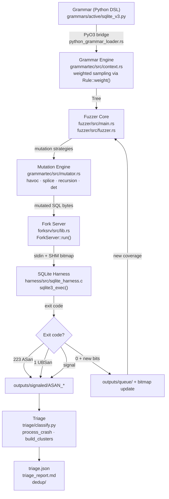

# Architecture — rl-nautilus-phase-2

Core system overview: five-layer pipeline from grammar definitions through crash triage.

> Last updated: 2026-05-14. Function and struct names refer to code in the
> repository at the time of writing.

---

## 1. System Overview

rl-nautilus-phase-2 is a grammar-based fuzzer built on the Nautilus 2.0
architecture. The system targets SQLite, fuzzing four CVE-bearing versions
(3.30.1, 3.31.1, 3.32.0, 3.32.2) to measure how weighted grammar sampling
affects CVE rediscovery rates relative to uniform baselines.

The pipeline has five layers: grammar definitions drive a weighted generation
engine; the fuzzer core orchestrates multi-threaded mutation, execution, and
coverage tracking; a fork-server mediates communication with the instrumented
SQLite harness; crashes land in an output directory; a triage pipeline
deduplicates and classifies them.

---

## 2. Component Map

| Component | Language | LoC (approx.) | Key Files | Purpose |
|-----------|----------|--------------|-----------|---------|
| **fuzzer/** | Rust | ~3,254 | `src/main.rs`, `src/fuzzer.rs`, `src/shared_state.rs`, `src/python_grammar_loader.rs` | Multi-threaded coordinator, state machine, mutation dispatch, coverage feedback |
| **grammartec/** | Rust | ~2,466 | `src/context.rs`, `src/rule.rs`, `src/mutator.rs`, `src/tree.rs` | Grammar engine, weighted sampling, tree representation, mutation primitives |
| **forksrv/** | Rust | ~426 | `src/lib.rs` | AFL fork-server protocol, shared memory bitmap, process lifecycle |
| **harness/** | C | ~89 | `src/sqlite_harness.c` | AFL fork-server harness, `setup_db()` constructor, `__AFL_INIT()`, crash oracle |
| **triage/** | Python | ~878 | `classify.py`, `stack_dedup.py`, `cve_signatures.py`, `fidelity_score.py`, `minimize.py` | Crash deduplication, exit-code classification, stack-hash grouping, CVE signature matching |
| **cve2grammar/** | Python | separate subtree | `cve2grammar/emitter.py`, `generalizer/render.py`, `generalizer/validate.py`, `generalizer/nonterminals.py` | CVE-to-grammar pipeline: scrape bugs, generalize to templates, validate, emit `ctx.rule()` calls |
| **scripts/** | Bash + Python | ~1,990 | `run_eval.sh`, `run_ablation.sh`, `capture_coverage.py`, `build_grammar.sh`, `analyze.py` | Campaign automation, ablation matrix, coverage CSV analysis, grammar composition |
| **grammars/** | Python DSL | varies | `active/sqlite_v3.py`, `legacy/sqlite_patterns.py`, `legacy/sqlite_attack.py` | Grammar definitions consumed by `python_grammar_loader::load_python_grammar()` |

---

## 3. Data Flow Summary

A single fuzzing iteration flows through these steps (each detailed in the
per-topic docs):

1. **Grammar loading** — `load_python_grammar()` acquires the Python GIL,
   executes the grammar `.py` file, and returns a populated `Context`.
   See `docs/core/grammar-engine.md`.

2. **Thread initialization** — `main()` clones the `Context` per thread and
   spawns `N` fuzzing threads via `fuzzing_thread()`.

3. **Input generation** — `state.generate_random("START")` drives
   `Context::generate_tree_from_nt()` with weighted sampling.
   See `docs/core/grammar-engine.md`.

4. **Mutation** — queue items cycle through `InputState::Init → Det → Random`,
   dispatching to `DefaultPolicy` which runs splice + havoc + havoc_recursion.
   See `docs/core/coverage-loop.md`.

5. **Execution** — `Fuzzer::exec_raw()` sends bytes to `ForkServer::run()`,
   which forks the harness and reads the exit status.
   See `docs/core/coverage-loop.md`.

6. **Coverage detection** — `Fuzzer::new_bits()` compares the per-run SHM
   bitmap against `GlobalSharedState.bitmaps`. Novel paths enter the queue.
   See `docs/core/coverage-loop.md`.

7. **Crash classification** — exit codes are wrapped in `ExitReason` and
   routed to `outputs/signaled/` or `outputs/queue/`.
   See `docs/core/triage-pipeline.md`.

---

## Appendix: Key File Reference

| File | Role |
|------|------|
| `fuzzer/src/main.rs` | Entry point: CLI parsing, `Context` init, thread spawning, status display |
| `fuzzer/src/fuzzer.rs` | `Fuzzer` struct, `run_on()`, `exec()`, `new_bits()`, `ExecLogger` |
| `fuzzer/src/python_grammar_loader.rs` | `PyContext` `#[pyclass]`, `load_python_grammar()` |
| `grammartec/src/context.rs` | `Context`, `add_rule_weighted()`, `get_random_rule_for_nt()`, `set_weight()` |
| `grammartec/src/rule.rs` | `Rule` enum, `PlainRule`, `ScriptRule`, `RegExpRule`, `weight` field |
| `grammartec/src/mutator.rs` | `Mutator`, `mut_random()`, `mut_splice()`, `mut_random_recursion()`, `mut_rules()` |
| `forksrv/src/lib.rs` | `ForkServer`, `new()`, `run()`, `get_shared()`, `create_shm()` |
| `harness/src/sqlite_harness.c` | `setup_db()` constructor, `main()`, `read_input()`, `__AFL_INIT()` |
| `triage/classify.py` | `classify_crash()`, `extract_frames()`, `build_clusters()`, `triage()` |
| `cve2grammar/cve2grammar/emitter.py` | `emit_nautilus()` — Bug → `ctx.rule()` |
| `cve2grammar/cve2grammar/generalizer/render.py` | `render_grammar()` — cache entries → grammar source |
| `cve2grammar/cve2grammar/generalizer/validate.py` | `validate_template()` — 7-invariant gate |
| `cve2grammar/cve2grammar/generalizer/nonterminals.py` | `load_whitelist()` — extract NT names from grammar |
| `grammars/active/sqlite_v3.py` | Active grammar: `START`, `Sql-Stmt`, `Schema-Setup`, weighted rules |
| `scripts/run_ablation.sh` | 4-variant × N-run ablation driver |
| `scripts/run_eval.sh` | Single campaign runner |
| `scripts/capture_coverage.py` | Coverage CSV → plot data |
