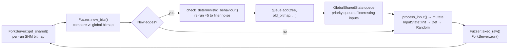

# Coverage Loop

Mutation strategies, fork-server execution, coverage bitmap tracking, and feedback queue.

> Last updated: 2026-05-14. Function names refer to code in the repository at the time of writing.

---

## 1. Mutation (Step 4)

Queue items cycle through three states managed by `process_input()` in
`fuzzer/src/main.rs`:

| `InputState` | Action |
|---|---|
| `Init(start)` | Tree minimization via `Mutator::minimize_tree()` and `Mutator::minimize_rec()` — batch of 200 nodes per call |
| `Det((cycle, start))` | Deterministic rule mutation via `Mutator::mut_rules()`, plus `state.splice()` and `state.havoc()` after each step |
| `Random` | `DefaultPolicy::select_action()` returns `None`: all three strategies run — `state.splice()`, `state.havoc()`, `state.havoc_recursion()` |

### DefaultPolicy dispatch

In `InputState::Random`, `DefaultPolicy` (in `fuzzer/src/fuzzer.rs`) runs all
three strategies unconditionally on every iteration:

1. `state.splice()` — 100 iterations via `Mutator::mut_splice()`
2. `state.havoc()` — 100 iterations via `Mutator::mut_random()`
3. `state.havoc_recursion()` — 20 iterations via `Mutator::mut_random_recursion()`

### Mutation primitives

All mutation primitives are implemented in `grammartec/src/mutator.rs`:

| Variant | `ExecutionReason` | Method | Description |
|---|---|---|---|
| `Gen` | `generate_random("START")` | fresh tree from grammar | Weighted sampling from `START` non-terminal |
| `Min` | `minimize()` | `mutator.minimize_tree()` | Shrink tree while preserving coverage bits |
| `MinRec` | `minimize()` | `mutator.minimize_rec()` | Recursive subtree shrink |
| `Det` | `deterministic_tree_mutation()` | `mutator.mut_rules()` | Enumerate all alternative rules at each node |
| `Havoc` | `havoc()` | `mutator.mut_random()` | Replace a random subtree node with a freshly generated subtree of the same non-terminal type |
| `HavocRec` | `havoc_recursion()` | `mutator.mut_random_recursion()` | Identify a recursive pattern and unroll it N times to increase nesting depth |
| `Splice` | `splice()` | `mutator.mut_splice()` | Replace a random node with an alternative subtree from the `ChunkStore` (cross-tree graft) |

### Det phase details

The Det phase runs for `config.number_of_deterministic_mutations` full cycles.
Each cycle exhausts all tree nodes one by one (batch size 1). After each Det
step, `splice` + `havoc` + `havoc_recursion` also run. When all cycles
complete, the item advances to `InputState::Random`.

---

## 2. Execution (Step 5)

`Fuzzer::run_on()` serializes the tree to bytes and calls `Fuzzer::exec()`,
which calls `Fuzzer::exec_raw()`. The full call chain:

```
FuzzingState::havoc / splice / det / generate_random
  └─ Fuzzer::run_on_with_dedup(tree, exec_reason, ctx)   fuzzer.rs:170
       └─ Fuzzer::run_on(code, tree, exec_reason, ctx)    fuzzer.rs:194
            └─ Fuzzer::exec(code, tree, ctx, strategy)    fuzzer.rs:365
                 └─ Fuzzer::exec_raw(code)                fuzzer.rs:332
                      └─ ForkServer::run(data)            forksrv/src/lib.rs:192
```

`exec_raw()` writes the SQL bytes to a temp file, sends a 4-byte start signal
to the fork server's control pipe, reads the child PID from the status pipe,
and then reads the exit status.

The fork server was started in `ForkServer::new()`: it `fork()`s a child
process, connects the child's file descriptors 198/199 to the control/status
pipes (AFL fork-server protocol), maps a POSIX shared-memory segment
(`shmget`/`shmat`), and `execve()`s the harness binary with
`__AFL_SHM_ID=<id>` and `ASAN_OPTIONS=exitcode=223,...` in the environment.

---

## 3. Coverage Detection (Step 6)

After each execution, `Fuzzer::new_bits()` compares the per-execution coverage
bitmap (read from shared memory via `ForkServer::get_shared()`) against the
global accumulated bitmap stored in `GlobalSharedState.bitmaps`. Any bitmap
slot that is non-zero in the run but zero in the global map represents a
newly discovered edge.



The global bitmap lives in `GlobalSharedState.bitmaps: HashMap<bool, Vec<u8>>`
keyed by `is_crash` (separate bitmaps for crash paths and non-crash paths).
The status thread emits a `coverage.csv` row every second containing
`timestamp_sec, total_edges, total_crashes, exec_count, policy`.

---

## 4. Coverage Bitmap Details

### Shared memory allocation

`ForkServer::create_shm(bitmap_size)` in `forksrv/src/lib.rs` calls
`shmget(IPC_PRIVATE, bitmap_size, ...)` and `shmat()` to map the segment.
The segment ID is passed to the child via `__AFL_SHM_ID` in the environment.
Each byte is an edge-hit counter (AFL semantics: byte at index
`src_id XOR (dst_id >> 1)` is incremented on each branch transition).

Default size: `bitmap_size: 65536` (64 KiB) in `config.ron`; campaigns set
`bitmap_size: 2097152` (2 MiB) via `run_eval.sh`. Pass `AFL_MAP_SIZE=<n>` to
tell the AFL++ runtime to use the same size.

The `bitmap_size` must match between the fuzzer and the harness. Mismatches
cause false-positive new-bit detection.

### Dual bitmaps

`GlobalSharedState` holds a `HashMap<bool, Vec<u8>>` initialised with two
zero-filled `Vec<u8>` of length `bitmap_size`:

- key `false` — coverage map for non-crashing executions
- key `true` — coverage map for crashing executions

### new_bits() detection

`Fuzzer::new_bits()` in `fuzzer.rs`:

```rust
pub fn new_bits(&mut self, is_crash: bool) -> Option<Vec<usize>> {
    let run_bitmap = self.forksrv.get_shared();
    let shared_bitmap = gstate_lock.bitmaps.get_mut(&is_crash);
    for (i, elem) in shared_bitmap.iter_mut().enumerate() {
        if (run_bitmap[i] != 0) && (*elem == 0) {
            *elem |= run_bitmap[i];
            res.push(i);
        }
    }
    if res.len() > 0 { Some(res) } else { None }
}
```

A bit position is "new" if the per-run bitmap byte is non-zero while the global
byte is still zero. On first discovery the global byte is updated (`|=`), so
subsequent identical paths do not produce new bits.

---

## 5. Deterministic Validation

After `new_bits()` returns `Some(bits)`, `Fuzzer::check_deterministic_behaviour()`
in `fuzzer.rs` re-executes the input five additional times to filter
non-deterministic edge hits:

```rust
fn check_deterministic_behaviour(
    &mut self,
    old_bitmap: &[u8],
    new_bits: &mut Vec<usize>,
    code: &[u8],
) -> Result<(), SubprocessError> {
    for _ in 0..5 {
        self.exec_raw(code)?;
        let run_bitmap = self.forksrv.get_shared();
        new_bits.retain(|&i| run_bitmap[i] != 0);  // drop flaky bits
    }
}
```

A bit is retained only if it appears in all five re-runs. Bits that fail any
single run are removed. If `new_bits` is empty after filtering, the input is
discarded. This costs 5× extra executions per genuinely new path but prevents
the queue from filling with jitter-induced entries.

---

## 6. Input Deduplication

Before execution, `Fuzzer::input_is_known(code)` checks a per-thread ring
buffer of the last 10,000 inputs:

```rust
last_tried_inputs: HashSet<Vec<u8>>,           // O(1) membership test
last_inputs_ring_buffer: VecDeque<Vec<u8>>,    // eviction order
```

Duplicate inputs within the 10,000-entry window are skipped before reaching
`exec_raw`. The dedup is per-thread — identical inputs from two threads can
both reach the fork server.

`run_on_without_dedup()` bypasses this check and is used during minimization
re-runs, where deliberate re-execution of known inputs is required.
